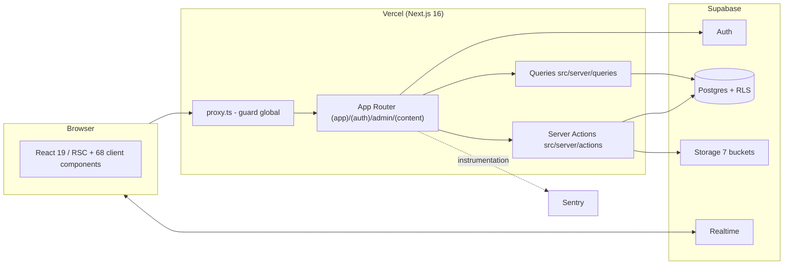
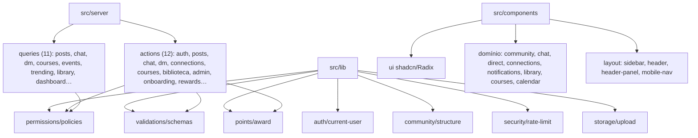
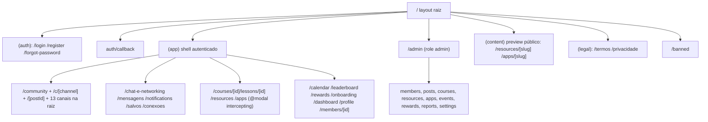
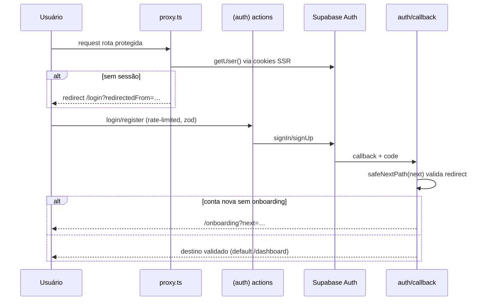
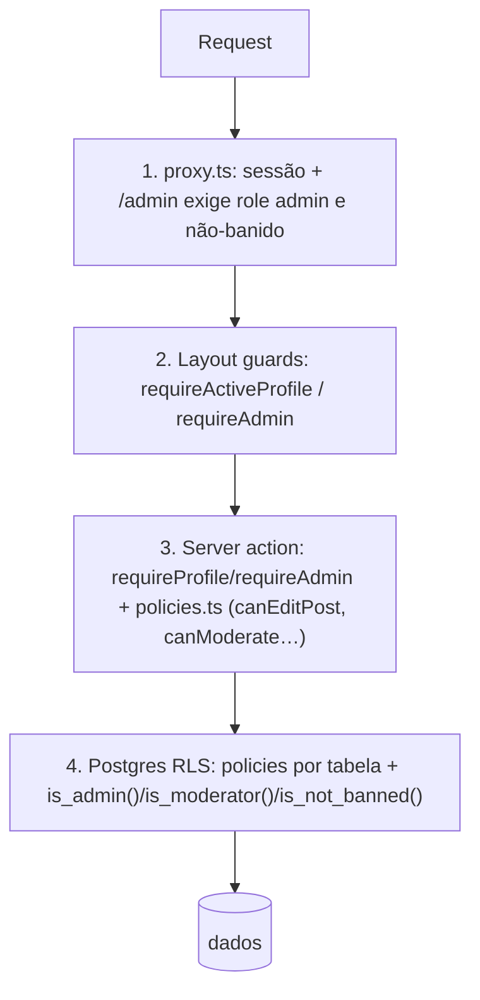
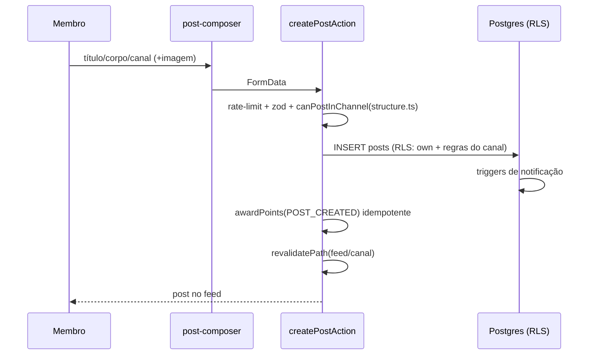
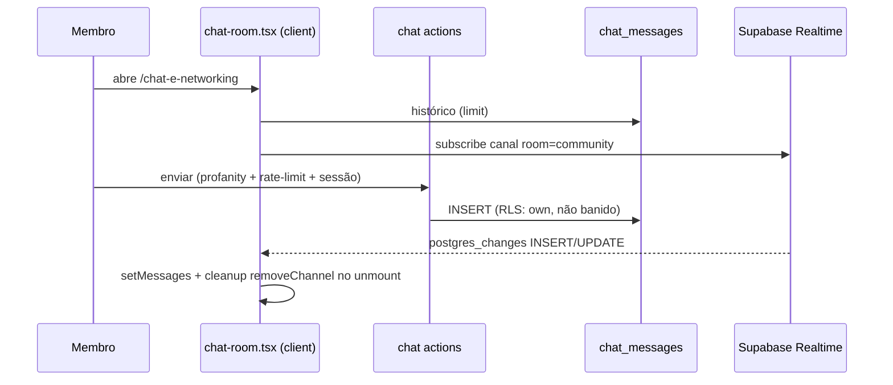
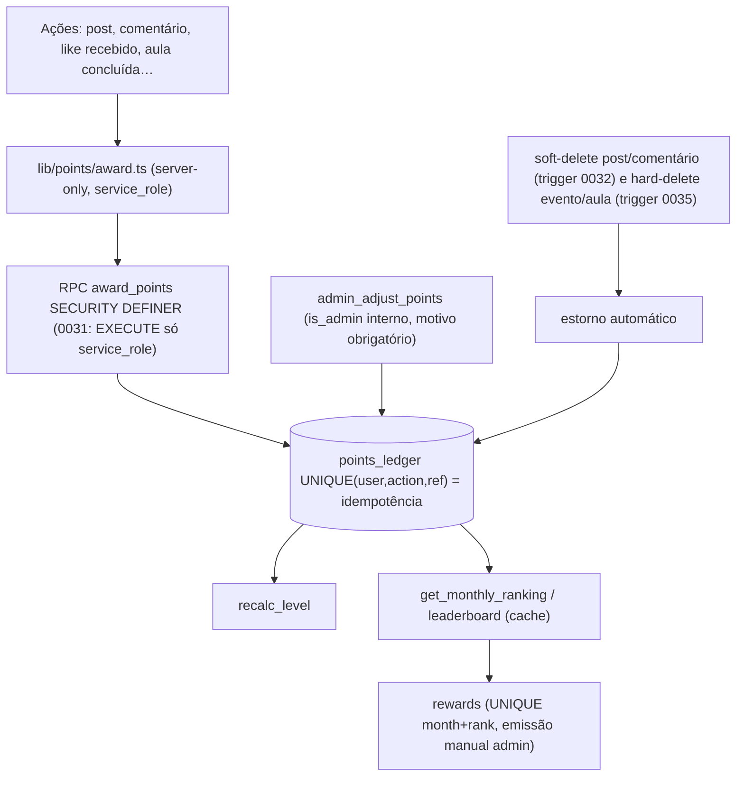
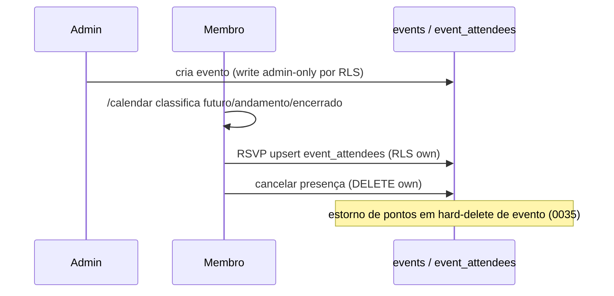
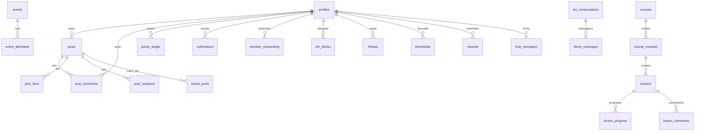

# AUDITORIA PÓS-RELEASE — ARQUITETURA

**Data:** 2026-07-08 · HEAD `fea4992` · Confiança dos itens: VERIFICADO salvo indicação.

## 1. Avaliação geral

**Saúde arquitetural: 8/10.** Projeto modular, com fontes de verdade centralizadas e defesa em profundidade deliberada (guards de layout → policies de aplicação → RLS). As features recentes (Chat, DM, Header Social, Biblioteca 2.0, Onboarding, Trending, Rewards) foram integradas sem quebrar a estrutura.

### Respostas às 10 perguntas da auditoria

1. **Modular?** Sim (7–8/10). Separação clara `(auth)` → `(app)` → `admin`; `src/server` (actions/queries) e `src/lib` (auth, permissions, validations, points, community, security, storage) bem particionados.
2. **Features recentes criaram acoplamento?** Moderado e controlado: o layout `(app)` agrega 3 contagens (DMs, notificações, conexões) por navegação — custo de performance, não de design (ver PERF-07 na auditoria técnica).
3. **Módulos grandes demais?** `post-card.tsx` (438 linhas: edição + reações + moderação) é o único arquivo inchado relevante. `community-feed.tsx` (213) aceitável.
4. **Arquivos com responsabilidades demais?** Apenas o `post-card.tsx` acima. Candidato a extração de `EditPostDialog`/menu de moderação — **não bloqueante**.
5. **Fontes de verdade claras?** Sim: `lib/validations/schemas.ts` (schemas), `lib/permissions/policies.ts` (permissões), `lib/community/structure.ts` (canais/legado), `lib/points/award.ts` (pontos), `lib/auth/current-user.ts` (guards). Única transição em aberto: categorias legadas → canais (mapeada e documentada em `structure.ts`).
6. **Admin reutiliza fluxos contextuais?** Sim na lógica (mesmas server actions com check `isModerator` interno); duplica apenas apresentação (tabela vs card) — redundância aceitável.
7. **Lógica de negócio em componentes visuais?** Contida: regras vivem em server actions; exceção parcial no `post-card.tsx`.
8. **Abstrações prematuras?** Não detectadas — `avatar-uploader`/`cover-uploader` compartilham `useImageUpload` e mantêm UX distinta; forms de recurso/app duplicam pouco e têm só 2 consumidores (não unificar).
9. **Preparada para novas features?** Sim — infra de notificações, ledger de pontos, saved_posts e `chat_messages.room` são pontos de extensão prontos (ver FEATURE_OPPORTUNITIES).
10. **Áreas a PROTEGER contra refatoração desnecessária:** `lib/community/structure.ts` (mapa de canais/legado), `lib/permissions/policies.ts` (afeta 3 camadas), `lib/points/award.ts` (idempotência crítica), guards de layout (`requireActiveProfile`/`requireAdmin`), `schemas.ts`, e a lógica de reentrância do `post-card.tsx`.

### Sobreposições julgadas

| Caso | Veredito |
|---|---|
| Guards em proxy.ts + layouts + server actions + RLS | **Defesa em profundidade válida** |
| Admin `/admin/posts` vs moderação contextual no post-card | **Redundância aceitável** (mesmas actions, UX distinta) |
| Notificações vs DM vs Chat | **Bem separados** (3 sistemas independentes) |
| Canais novos vs categorias legadas | **Transitório por design** (remap Fase 5 pendente) |
| award_points / admin_adjust_points / revert triggers | **Sem conflito** — operações distintas sobre o mesmo ledger, idempotência por unique constraint |

### Legacy (nada a remover durante a auditoria)

| Item | Classificação |
|---|---|
| `DEPRECATED_CHANNELS` (4 canais sem rota raiz) | Manter — remap de conteúdo previsto e ainda não executado |
| `LEGACY_CATEGORIES` + `LEGACY_CATEGORY_TO_CHANNEL` | Manter até remap; retrocompat ativa |
| `PENDING_CHANNELS` (vazio hoje) | Manter estrutura |
| `community_migration_backup` (tabela) | Manter; definir retenção futuramente |
| Docs de fases antigas em `docs/` | Manter como histórico (ver seção Documentação da auditoria técnica) |
| Componentes órfãos | Nenhum detectado por grep |

---

## 2. Diagramas (refletem o código real)

### 2.1 Arquitetura geral

### 2.2 Mapa de módulos

### 2.3 Hierarquia de rotas

### 2.4 Fluxo de autenticação

### 2.5 Fluxo de permissões (defesa em profundidade)

### 2.6 Fluxo de publicação

### 2.7 Fluxo do Chat Network

### 2.8 Fluxo de pontos

### 2.9 Fluxo de eventos e RSVP

### 2.10 Mapa simplificado do banco

---

*Nenhuma refatoração foi executada. Recomendações de mudança estão na auditoria técnica e no roadmap, sujeitas a aprovação explícita.*
